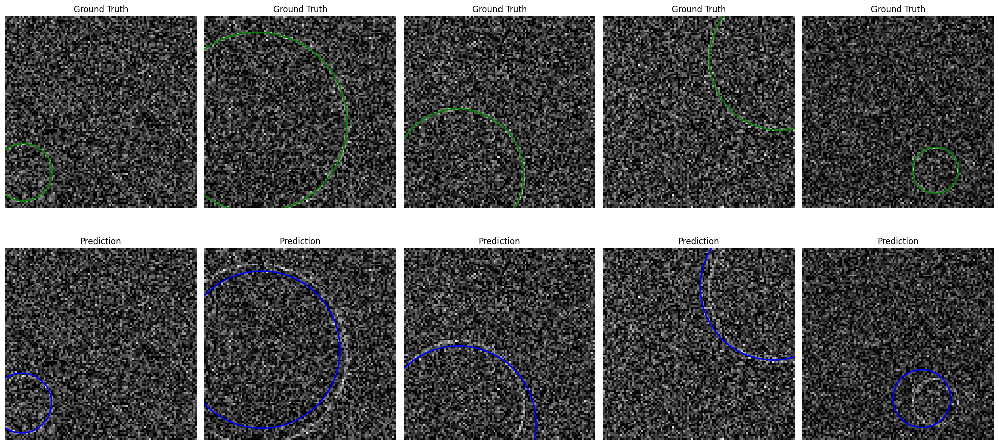
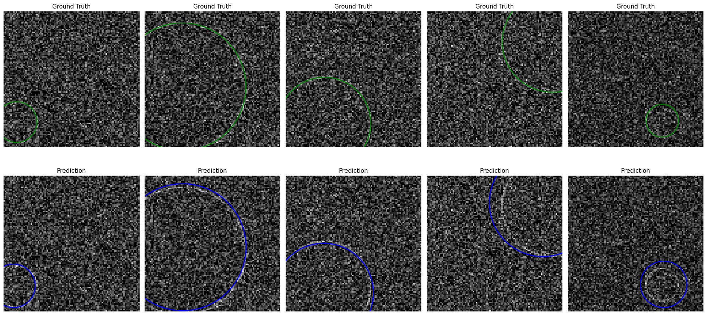
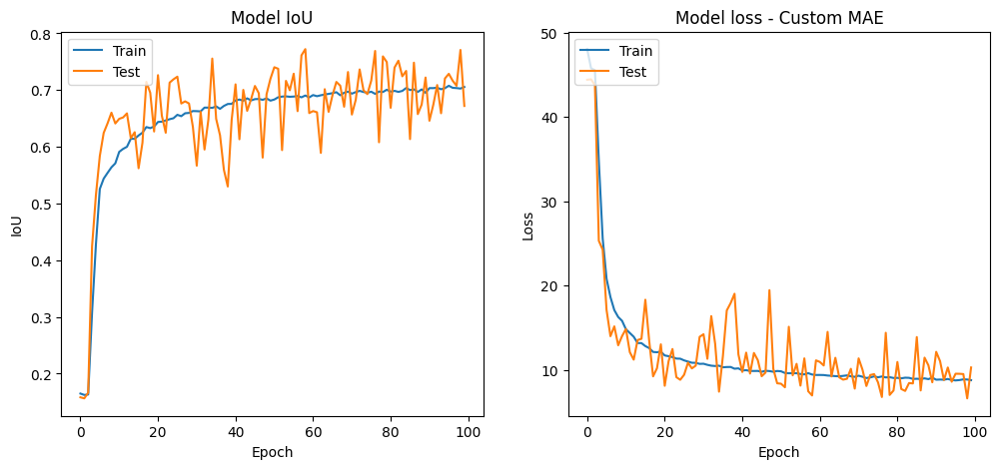
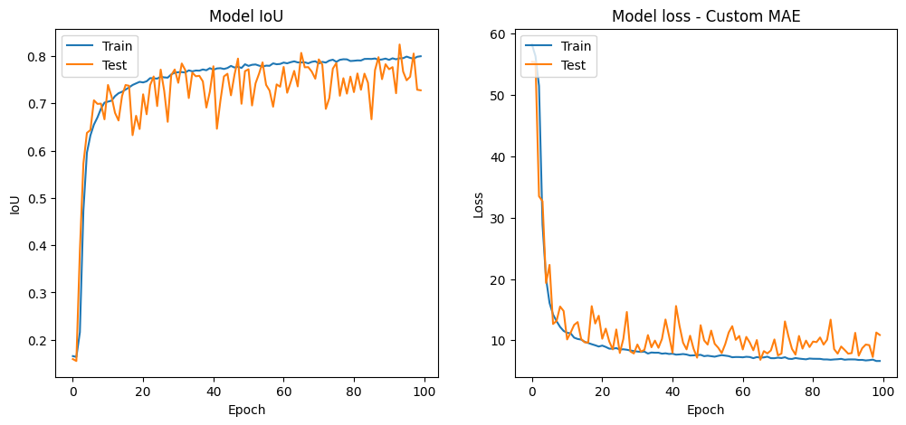

# Circle Detection ML Challenge 🎯

## Overview
This repository contains the code and models for the Circle Detection ML Challenge 🌟, focused on detecting circles in noisy images using machine learning. The goal is to develop a model that identifies the circle's center coordinates and radius from an input image.

## Features
- **Helper Functions:** 🛠️ For generating and displaying noisy circles and computing Intersection Over Union (IoU).
- **Evaluation Metric:** 📏 Accuracy determined by thresholded IoU.
- **Data Preprocessing:** 📊 Techniques for dataset creation, image preprocessing, and data visualization.
- **Custom Loss Function:** 🧬 A unique Circle Loss Function to enhance model performance.
- **Models:** 💻 Two models of varying complexities (10M and 82M parameters).

## Methodology
- **Dataset Creation:** 📸 10,000 images with varied noise levels and circle sizes.
- **Image Preprocessing:** 🖼️ Steps include clipping, normalization, and reshaping.
- **Model Architecture:** 🏗️ Sequential CNN architecture.
- **Training and Evaluation:** 📚 Using custom loss functions and IoU metrics.

Download the 10M model from [here](https://drive.google.com/file/d/1LWZ-DMplO7Un-KQbCuHVfNz_e5-IujnP/view?usp=drive_link).
Download the 82M model from [here](https://drive.google.com/file/d/1XAoDWqFin-hM5hBfz3DghsGSdMOu_2R3/view?usp=sharing).

## Results
📈 Detailed analysis of both models' performance in detecting circles under noisy conditions included in PDF attached.

# Performance Metrics Comparison

## Table: Test Performance Metrics 📊

| Metric                                          | 10M Model | 82M Model |
| ------------------------------------------------|-----------|-----------|
| Test Loss                                       | 8.2116    | 6.7374    |
| Test Accuracy                                   | 0.7721    | 0.8012    |
| Mean Absolute Error for X                       | 3.5858    | 2.9991    |
| Mean Absolute Error for Y                       | 3.8515    | 3.1148    |
| Mean Absolute Error for Radius                  | 3.2960    | 3.0055    |
| Percentage of Test Examples with IOU ≥ 0.5      | 87.90%    | 89.80%    |
| Percentage of Test Examples with IOU ≥ 0.75     | 63.00%    | 68.90%    |
| Percentage of Test Examples with IOU ≥ 0.9      | 33.30%    | 39.90%    |
| Percentage of Test Examples with IOU ≥ 0.95     | 27.20%    | 31.50%    |

## Figures

### Prediction Results of 10M Model

### Prediction Results of 82M Model

### Training of 10M Model

### Training of 82M Model

## Conclusion
🔍 Demonstration of deep learning techniques in detecting circles in noisy environments.

## Code Quality
✅ Maintained high code quality with proper formatting, typing, and comments for clarity.
